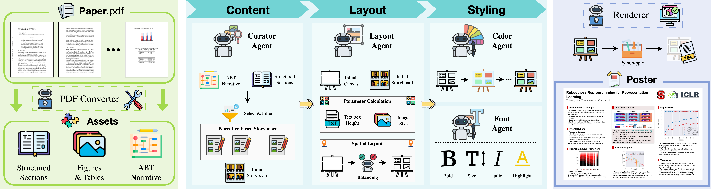
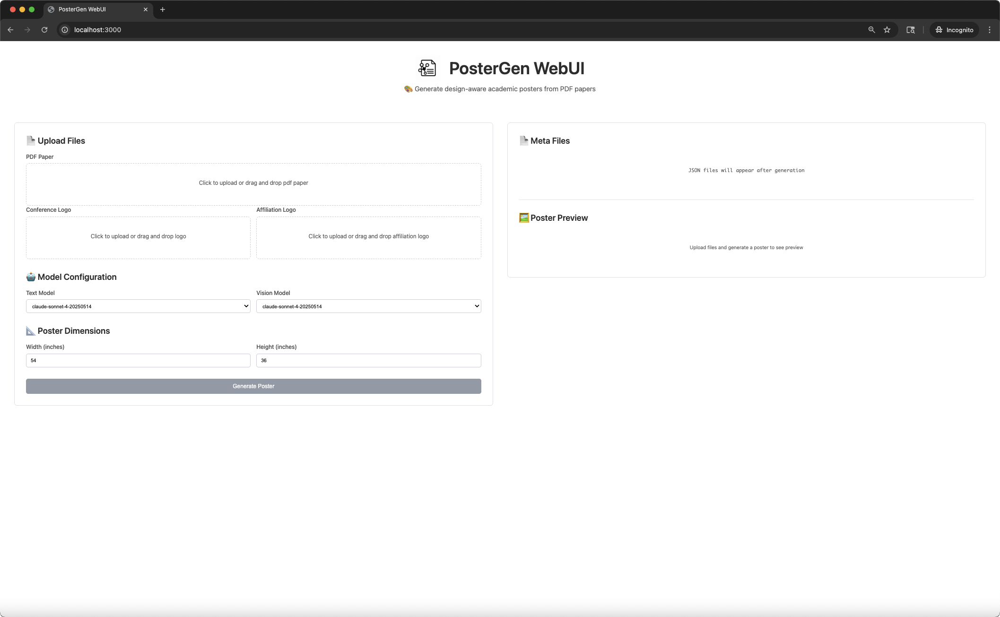
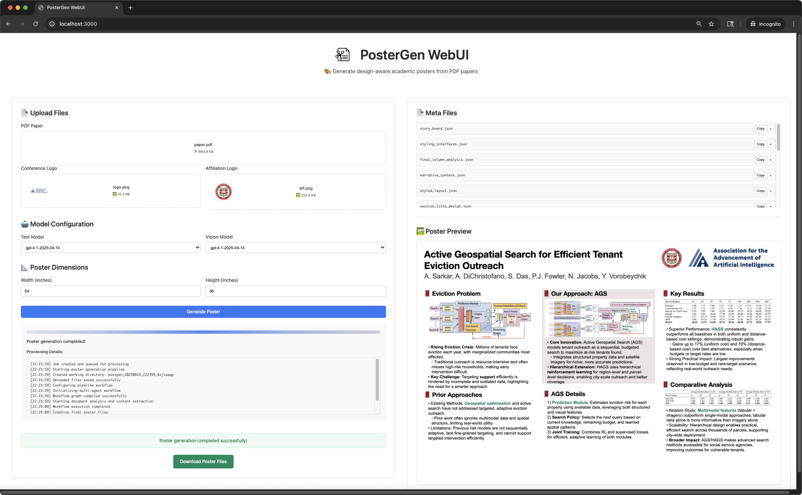
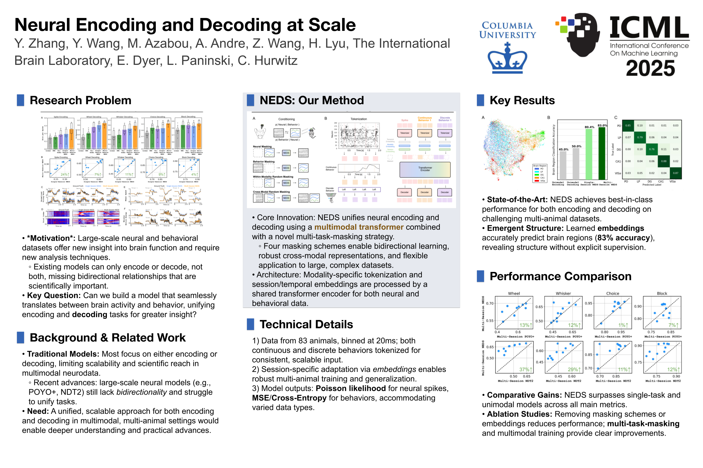
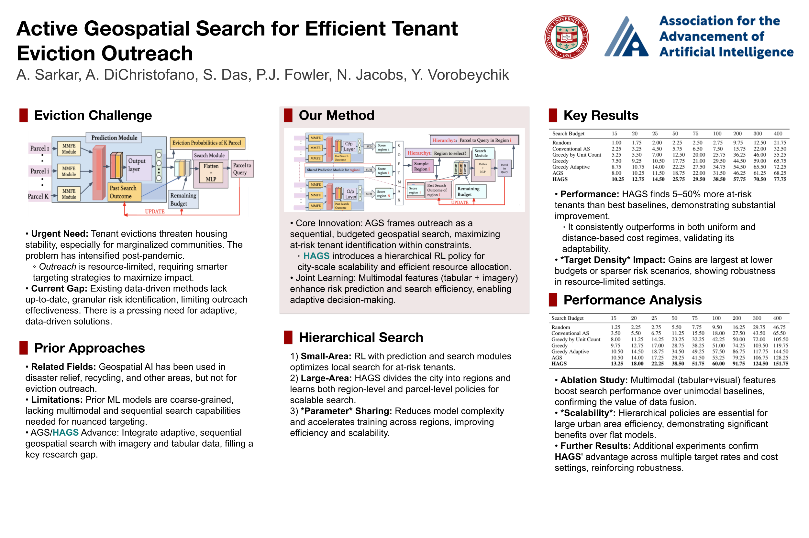

<div align="center">
  
  

  <h2>PosterGen: Aesthetic-Aware Paper-to-Poster Generation via <br> Multi-Agent LLMs</h2>
  <!-- <h4>🌟 🌟</h4> -->
  
  <br>
  
  <p>
    <a href="https://hadlay-zhang.github.io">Zhilin Zhang</a><sup>1,2 ★</sup>&nbsp;
    <a href="https://wyattz23.github.io">Xiang Zhang</a><sup>3 ★</sup>&nbsp;
    <a href="https://upup-wei.github.io/">Jiaqi Wei</a><sup>4</sup>&nbsp;
    <a href="https://Y-Research-SBU.github.io/PosterGen">Yiwei Xu</a><sup>5</sup>&nbsp;
    <a href="https://chenyuyou.me/">Chenyu You</a><sup>1</sup>
  </p>

  <p>
    <sup>1</sup> Stony Brook University &nbsp;&nbsp; 
    <sup>2</sup> New York University &nbsp;&nbsp;
    <sup>3</sup> University of British Columbia &nbsp;&nbsp; <br>
    <sup>4</sup> Zhejiang University &nbsp;&nbsp; 
    <sup>5</sup> University of California, Los Angeles &nbsp;&nbsp; 
    <sup>★</sup> Equal Contribution <br>
  </p>

<p align="center">
  <a href="https://arxiv.org/abs/2508.17188">
    
  </a>
  <a href="https://Y-Research-SBU.github.io/PosterGen">
    
  </a>
  <a href="https://huggingface.co/spaces/Y-Research-Group/PosterGen">
    
  </a>
  <a href="#">
    
  </a>
  <br>
  <a href="https://github.com/Y-Research-SBU/PosterGen/issues/1">
    
  </a>
  <a href="https://discord.gg/BSJpG8TQSg">
    
  </a>
</p>

</div>

## Abstract

> In this work, we propose a multi-agent LLMs framework that is guided by design principles.  
> Our multi-agent LLMs adopt a workflow of specialist agents that mirrors a professional design process:
>
> - **Parser Agent** – extracts and structures all content from the source paper.  
> - **Curator Agent** – designs a narrative-based storyboard.  
> - **Layout Agent** – transforms the storyboard into a spatially balanced, three-column layout.  
> - **Styling Agents** – apply a harmonious color palette and a hierarchical typographic system to ensure aesthetic coherence.  
>
> This methodology is designed to generate a well-designed poster that minimizes the need for manual fine-tuning.



## 📢 News

- **2025.08.26** Our paper is now available on [arXiv](https://arxiv.org/abs/2508.17188)! 📄
- **2025.08.23** Code Released. PosterGen now available! 🎉🎉

## 🚀 Quick Start

### System Requirements
- **Operating System**: Windows, Linux, or macOS
- **Python Version**: 3.11

### 1. Environment Setup

#### Option 1: [UV](https://docs.astral.sh/uv/getting-started/installation/) (Recommended)

```bash
git clone -b main https://github.com/Y-Research-SBU/PosterGen.git
cd PosterGen

uv sync
```

#### Option 2: Conda

```bash
# Create and activate conda environment
conda create -n poster python=3.11 -y
conda activate poster

git clone -b main https://github.com/Y-Research-SBU/PosterGen.git
cd PosterGen

pip install -r requirements.txt
```

### 2. Install LibreOffice

**Windows:**
1. Download and install LibreOffice from [official website](https://www.libreoffice.org/download/download/)
2. Add LibreOffice to your system PATH:
   - Default installation: Add `C:\Program Files\LibreOffice\program` to PATH
   - Or custom installation: Add `<your_install_path>\LibreOffice\program` to PATH

**macOS:**
```bash
brew install --cask libreoffice
```

**Ubuntu/Linux:**
```bash
sudo apt install libreoffice
# Or using snap:
sudo snap install libreoffice
```

### 3. API Keys Configuration

Create a `.env` file in the project root with your API keys:

```bash
OPENAI_API_KEY="your_openai_key"
ANTHROPIC_API_KEY="your_anthropic_key"
ZHIPU_API_KEY="your_zhipu_key"
```

To use a compatible API service or a custom deployment, set the base URL in your `.env` file:

```bash
OPENAI_BASE_URL="https://your-api-endpoint.com/v1"
ANTHROPIC_BASE_URL="https://your-anthropic-endpoint.com"
GOOGLE_BASE_URL="https://your-google-endpoint.com"
ZHIPU_BASE_URL="https://your-zhipu-endpoint.com"
```

## Data Structure Setup

Before running the multi-agent pipeline, organize your files in the `data/` folder:

```
data/
└── <your_paper_name>/
    ├── paper.pdf          # Your research paper (required)
    ├── aff.png           # Affiliation logo for color extraction (required)
    └── logo.png          # Conference logo for poster (required)
```

**Examples (check ``data/`` folder):**
```
data/
└── Neural_Encoding_and_Decoding_at_Scale/
    ├── paper.pdf
    ├── aff.png
    └── logo.png
└── ...
```

## 🎯 Usage

### Command-line Interface

Generate your poster with a single command:

**For UV setup:**
```bash
uv run python -m src.workflow.pipeline \
  --poster_width 54 --poster_height 36 \
  --paper_path ./data/Your_Paper_Name/paper.pdf \
  --text_model gpt-4.1-2025-04-14 \
  --vision_model gpt-4.1-2025-04-14 \
  --logo ./data/Your_Paper_Name/logo.png \
  --aff_logo ./data/Your_Paper_Name/aff.png
```

**For Conda setup:**
```bash
python -m src.workflow.pipeline \
  --poster_width 54 --poster_height 36 \
  --paper_path ./data/Your_Paper_Name/paper.pdf \
  --text_model gpt-4.1-2025-04-14 \
  --vision_model gpt-4.1-2025-04-14 \
  --logo ./data/Your_Paper_Name/logo.png \
  --aff_logo ./data/Your_Paper_Name/aff.png
```

**Parameters:**
- `--poster_width/height`: Poster dimensions in inches, with aspect ratio (w/h): lower bound 1.4 (ISO A paper size), upper bound 2 (human vision limit)
- `--paper_path`: Path to your PDF paper
- `--text_model`: LLM for text processing (options: "gpt-4.1-2025-04-14" (default), "gpt-4o-2024-08-06", "gpt-4.1-mini-2025-04-14", "claude-sonnet-4-20250514")
- `--vision_model`: Vision model for analysis (same options as text_model)
- `--logo`: Conference logo
- `--aff_logo`: Affiliation logo (used for color scheme extraction)

### Web Interface

> Developed by: React + TypeScript + Vite

Upload your PDF paper and logos through drag-and-drop, configure models and dimensions, then generate and download your poster files.

**Prerequisites:**
- Node.js installed
- Main PosterGen dependencies installed (from project root)
- API keys configured in `.env` file

```bash
# Install main project dependencies (if not done already, refer to Environment Setup above)

# Start backend
cd webui && python start_backend.py

# Start frontend (in new terminal, from project root)
cd webui && sh ./start_frontend.sh

# Open http://localhost:3000 in your browser
```





## Output Structure

After successful generation, you'll find your results in the `output/` folder:

```
output/
└── <paper_name>/
    ├── <paper_name>.png           # final poster image
    ├── <paper_name>.pptx          # editable PowerPoint file
    ├── assets/                    # extracted content from paper via Marker
    │   ├── figures.json           # figure metadata with aspect ratios
    │   ├── tables.json            # table metadata with aspect ratios
    │   ├── figure-*.png           # individual figures from paper
    │   ├── table-*.png            # individual tables from paper
    │   └── fig_tab_caption_mapping.json  # caption mappings
    └── content/                   # multi-agent artifacts
        ├── raw.md                         # raw text extraction
        ├── structured_sections.json      # organized sections
        ├── classified_visuals.json       # categorized visuals
        ├── narrative_content.json        # paper summary
        ├── story_board.json              # content organization
        ├── initial_layout_data.json      # initial layout
        ├── column_analysis.json          # column usage stats
        ├── optimized_story_board.json    # balanced content
        ├── balancer_decisions.json       # optimization details
        ├── final_column_analysis.json    # final usage metrics
        ├── optimized_layout.json         # balanced layout
        ├── final_design_layout.json      # element coordinates
        ├── color_scheme.json             # color palette
        ├── section_title_design.json     # title styling
        ├── keywords.json                  # highlighted terms
        ├── styled_layout.json            # formatted text
        └── styling_interfaces.json       # typography settings
```

## 🤖 Multi-Agent Pipeline

Our system uses 6 specialized AI agents working together:

1. **Parser Agent**: Extracts and structures content from paper PDF
2. **Curator Agent**: Plans content organization and visual placement  
3. **Layout Agent**: Calculates precise positioning and spacing
    - **Balancer Sub-Agent**: Optimizes column utilization and prevents overflow
5. **Color Agent**: Generates cohesive color schemes from your affiliation logo
7. **Font Agent**: Applies typography and keyword highlighting
8. **Renderer**: Generates final PowerPoint and image files

## Key Features

- **Professional Layout**: CSS-like precision positioning with proper spacing
- **Intelligent Balancing**: Automatic column optimization prevents overflow
- **Color Harmony**: Automatic color scheme generation from your institution branding
- **Typography Excellence**: Professional font choices and keyword highlighting
- **Flexible Output**: Both PNG images and editable PowerPoint files
- **Academic Standards**: Follows poster design best practices for conferences

## Other Configurations

The system supports customization through `config/poster_config.yaml`. You can adjust:

- Layout parameters (margins, padding, spacing)
- Typography settings (fonts, sizes, line spacing)
- Color generation algorithms
- Visual asset sizing constraints
- Content optimization thresholds

**Custom Fonts:**
If you would like to use other fonts, you can add the font files under `fonts/`, modify the `get_font_file_path()` mapping in `src/layout/text_height_measurement.py`, and adjust the 'typography' in `config/poster_config.yaml`.

## 📊 Example Results

Our system generates professional academic posters with high visual quality. Here are some examples of generated posters:





## Citation
```
@article{zhang2025postergen,
    title={PosterGen: Aesthetic-Aware Paper-to-Poster Generation via Multi-Agent LLMs},
    author={Zhilin Zhang and Xiang Zhang and Jiaqi Wei and Yiwei Xu and Chenyu You},
    journal={arXiv:2508.17188},
    year={2025}
}
```

## Acknowledgments

This codebase is built upon following open-source projects. We express our sincere gratitude to:

- **[LangGraph](https://github.com/langchain-ai/langgraph)**: Multi-agent workflow framework;
- **[Marker](https://github.com/datalab-to/marker)**: High-quality PDF parsing library that enables accurate content extraction from research papers.
- **[python-pptx](https://github.com/scanny/python-pptx)**: Python library for creating PowerPoint (.PPTX) poster files.

## Star History

[](https://www.star-history.com/#Y-Research-SBU/PosterGen&Date)
# PosterGen3
